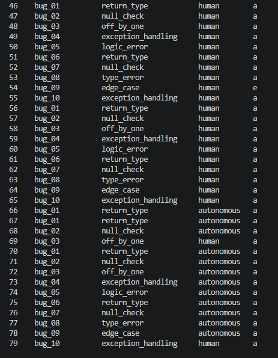

# Debug Agent

An autonomous debugging pipeline that learns from engineer feedback over time, requiring progressively less human intervention as it accumulates preferences.

## How it works

Each debug session follows this flow:

```
Bug file loaded
      ↓
Retrieve relevant memories from Mem0 (past engineer preferences)
      ↓
Compute confidence score from memory similarity
      ↓
      ├── HIGH confidence (≥ 0.80) → AUTONOMOUS
      │         Derive steering from memories → Generate fix → Auto-apply
      │
      └── LOW confidence (< 0.80) → HUMAN-IN-LOOP
                Generate fix with memory context → Engineer reviews
                Engineer: Accept / Reject / Edit / Steer
      ↓
Extract principle from edit (if edited) → Store memory → Log session
```

Memory compounds across sessions. After enough accepted fixes and edits, the agent learns the engineer's preferences and starts resolving bugs autonomously.

## Setup

**1. Install dependencies**

```bash
python -m venv venv
venv\Scripts\activate
pip install -r requirements.txt
```

**2. Configure `.env`**

```env
GROQ_API_KEY=your_groq_key
GROQ_MODEL=llama-3.3-70b-versatile
QDRANT_URL=https://your-cluster.qdrant.io
QDRANT_API_KEY=your_qdrant_key
CONFIDENCE_THRESHOLD=0.80
DEVELOPER_ID=dev_01
```

**3. Verify connections**

```bash
python test_config.py
```

## Usage

```bash
# Run all 10 canonical bugs (one benchmark round)
python main.py --mode canonical

# Run a single bug file
python main.py --mode single --file bugs/my_bug.py

# View benchmark report
python main.py --mode report

# Inspect stored memories
python check_memories.py
```

## Benchmark

The benchmark runs the same 10 bug files across multiple rounds. As memory accumulates between rounds, the agent's autonomy rate, acceptance rate, and confidence score should increase.

Run `python main.py --mode report` after each round to see the improvement delta.

## Project structure

```
├── main.py                      # Entry point and session orchestration
├── config.py                    # Mem0, Qdrant, and env config
├── agent/
│   ├── memory.py                # Mem0 read/write, principle extraction
│   ├── confidence.py            # Confidence scoring
│   ├── fixer.py                 # Fix generation (human path)
│   ├── steering.py              # Autonomous two-step fix chain
│   └── reviewer.py              # CLI review interface
├── benchmark/
│   ├── tracker.py               # Session logging
│   ├── report.py                # Benchmark report printer
│   ├── sessions.json            # Raw session data
│   └── canonical_bugs/          # 10 fixed bug files for controlled runs
└── check_memories.py            # Utility to inspect stored memories
```

## Results

After running the benchmark across multiple rounds, the agent visibly shifts from human-in-loop to autonomous resolution as memory accumulates.



In the early rounds (sessions ~46-65), every bug routes through the human path — the agent has no prior preferences to draw from. After few rounds (sessions ~66+), the agent has internalized enough engineer feedback that it begins resolving bugs autonomously, without any human review step. The transition is gradual: a few bugs still fall back to human when memory similarity is below the threshold, but the majority resolve end-to-end on their own.

This matches the intended design - memory compounds across sessions, and the confidence score climbs as the engineer's preferences become well-represented in the vector store.

## Design decisions

**`infer=False` in Mem0** - Mem0's default LLM extraction consumed 8000+ tokens per call, exceeding Groq's free-tier rate limit. All `memory.add()` calls use `infer=False` to store memories directly, bypassing Mem0's internal LLM while still initializing it for library compatibility.

**Principle extraction** - When an engineer edits a fix, the raw edit is passed through a short LLM prompt to extract the underlying preference ("Developer prefers early returns over nested conditionals"). This generalizes the learning beyond the specific bug.

**Two-step autonomous chain** - On the autonomous path, a first LLM call derives what steering the engineer *would have* given based on memories. A second call generates the fix using that steering. This mirrors the human-in-loop path and keeps the logic consistent.

**HuggingFace embeddings** - Switched from Gemini embeddings due to SDK incompatibility with Mem0's embedder interface. `multi-qa-MiniLM-L6-cos-v1` runs locally at 384 dimensions.
